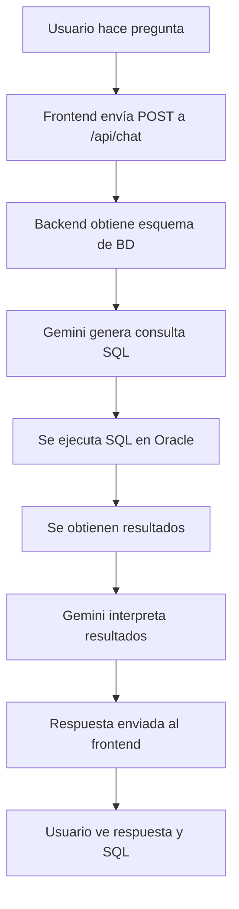

# 🎉 Implementación del Chat IA - Resumen

## ✅ Archivos creados/modificados

### Nuevos archivos creados:

1. **`templates/chat.html`**
   - Interfaz completa del chat con diseño estilo ChatGPT/Gemini
   - Botones de ejemplo para preguntas comunes
   - Sistema de mensajes con estilo usuario/IA
   - Muestra la consulta SQL generada en cada respuesta
   - Indicador de carga mientras procesa
   - Diseño responsive y moderno

2. **`.env.example`**
   - Plantilla con todas las variables de entorno necesarias
   - Incluye comentarios explicativos
   - Añadido `GOOGLE_API_KEY` para Gemini

3. **`CHAT_IA_SETUP.md`**
   - Guía completa de configuración del Chat IA
   - Instrucciones para obtener API Key de Google
   - Ejemplos de preguntas
   - Solución de problemas
   - Mejores prácticas

### Archivos modificados:

1. **`app.py`**
   - Añadidas importaciones: `google.generativeai`, `os`, `load_dotenv`
   - Configuración de Gemini con modelo `gemini-2.0-flash-exp`
   - Nueva ruta: `/chat` - Renderiza la página del chat
   - Nueva ruta API: `/api/chat` - Procesa las preguntas del usuario
   - Flujo completo: pregunta → SQL → ejecución → interpretación

2. **`templates/base.html`**
   - Añadido enlace "Chat IA" en el menú de navegación
   - Icono de robot para identificar la sección
   - Estado activo según la ruta actual

3. **`config.py`**
   - Añadida variable `GOOGLE_API_KEY` a la configuración

4. **`requirements.txt`**
   - Añadido `google-generativeai` (SDK de Gemini)
   - Añadido `tabulate` (para formatear resultados)

5. **`README.md`**
   - Actualizada la sección de características
   - Añadida información sobre el Chat IA
   - Nuevos ejemplos de preguntas
   - Actualizado el stack tecnológico

## 🔄 Flujo de funcionamiento



## 🚀 Características implementadas

### Frontend (chat.html)
- ✅ Diseño moderno inspirado en ChatGPT
- ✅ Burbujas de chat diferenciadas (usuario vs IA)
- ✅ Botones de ejemplo para preguntas comunes
- ✅ Visualización de la consulta SQL generada
- ✅ Indicador de carga mientras procesa
- ✅ Scroll automático al último mensaje
- ✅ Timestamps en los mensajes
- ✅ Manejo de errores con mensajes claros
- ✅ Soporte para Enter para enviar mensaje
- ✅ Animaciones suaves (fade in)

### Backend (app.py)
- ✅ Integración con Google Gemini API
- ✅ Generación automática de SQL desde lenguaje natural
- ✅ Descubrimiento dinámico del esquema de BD
- ✅ Ejecución segura de consultas SQL
- ✅ Interpretación de resultados con IA
- ✅ Manejo de errores robusto
- ✅ Protección con autenticación (@login_required)
- ✅ Limpieza de SQL (sin punto y coma, sin saltos de línea)

## 🎯 Ejemplos de uso

El usuario puede hacer preguntas como:

**Consultas básicas:**
- "¿Cuántos pacientes hay en total?"
- "¿Cuántos registros tenemos?"

**Análisis demográfico:**
- "¿Cuántos hombres y mujeres hay?"
- "¿Cuántos pacientes hay por comunidad?"

**Estadísticas:**
- "¿Cuál es el promedio de días de estancia?"
- "¿Cuál es el coste total?"

**UCI:**
- "¿Cuántos pacientes estuvieron en UCI?"
- "¿Cuál es el promedio de días en UCI?"

**Ranking:**
- "¿Qué comunidad tiene más ingresos?"
- "¿Cuáles son los 5 diagnósticos más comunes?"

## 📦 Dependencias instaladas

```bash
pip install google-generativeai tabulate
```

## ⚙️ Configuración necesaria

Añadir al archivo `.env`:

```bash
GOOGLE_API_KEY=tu-api-key-de-gemini-aqui
```

Obtener API Key en: https://makersuite.google.com/app/apikey

## 🔧 Prompt Engineering implementado

### Para generación de SQL:
```python
Eres un asistente experto en SQL para Oracle.
- Usa el esquema proporcionado
- Genera SQL compatible con Oracle
- NO uses punto y coma
- NO uses saltos de línea
- Devuelve SOLO la consulta SQL
```

### Para interpretación:
```python
Eres un experto en análisis de datos de salud mental.
- Resume e interpreta los resultados
- Respuesta natural y clara
- Usa emojis para hacer la respuesta amigable
```

## 🎨 Diseño UI

- **Colores**: Azul primario (#007bff) para mensajes del usuario
- **Tipografía**: System fonts con Courier New para código SQL
- **Espaciado**: Mensajes con max-width 80% para lectura fácil
- **Animaciones**: Fade in suave para nuevos mensajes
- **Iconos**: Font Awesome para usuario/robot
- **Layout**: Contenedor centrado de 900px máximo

## 🔐 Seguridad

- ✅ Rutas protegidas con `@login_required`
- ✅ API Key en variables de entorno (no en código)
- ✅ `.env` en `.gitignore`
- ✅ Validación de entrada del usuario
- ✅ Manejo seguro de errores sin exponer información sensible
- ✅ Conexión segura a Oracle con wallet

## 📊 Resultado esperado

1. Usuario accede a la pestaña "Chat IA"
2. Ve una interfaz limpia con ejemplos de preguntas
3. Escribe o selecciona una pregunta
4. Ve un indicador de "Procesando..."
5. Recibe respuesta interpretada + consulta SQL usada
6. Puede hacer más preguntas manteniendo el contexto visual

## 🐛 Manejo de errores

- ❌ API Key no configurada → Mensaje claro al usuario
- ❌ Pregunta vacía → Validación en frontend
- ❌ Error en SQL → Mensaje de error amigable
- ❌ Error de conexión → Mensaje de error con detalles
- ❌ Timeout de API → Indicador de carga se oculta

## 📱 Responsive Design

- ✅ Funciona en desktop
- ✅ Funciona en tablet
- ✅ Funciona en móvil
- ✅ Botones de ejemplo se ajustan en pantallas pequeñas
- ✅ Input y mensajes adaptativos

## 🎓 Tecnologías usadas

- **Backend**: Flask + Python
- **IA**: Google Gemini 2.0 Flash Exp
- **BD**: Oracle Autonomous Database
- **Frontend**: Bootstrap 5 + Vanilla JS
- **Procesamiento**: Pandas para resultados
- **Formato**: Tabulate para markdown

## ✨ Próximas mejoras posibles

1. **Historial de chat persistente** (guardar en sesión o BD)
2. **Exportar conversación** a PDF o texto
3. **Sugerencias inteligentes** basadas en el esquema
4. **Gráficos automáticos** cuando sea relevante
5. **Modo oscuro** para la interfaz
6. **Comandos especiales** (ej: /help, /clear, /export)
7. **Streaming de respuestas** (respuesta en tiempo real)
8. **Multi-idioma** (inglés, catalán, etc.)

## 🏆 Ventajas de esta implementación

1. **Sin frontend complejo**: Usa vanilla JavaScript, no frameworks
2. **Escalable**: Fácil añadir más funcionalidades
3. **Mantenible**: Código limpio y bien documentado
4. **Seguro**: Protección en múltiples capas
5. **Educativo**: Muestra el SQL generado para aprender
6. **UX moderna**: Diseño inspirado en ChatGPT/Gemini
7. **Integración perfecta**: Se integra con el sistema existente

---

## 🎉 ¡Listo para usar!

El chat IA está completamente funcional. Solo necesitas:
1. Obtener tu API Key de Google Gemini
2. Añadirla al archivo `.env`
3. Reiniciar la aplicación
4. Acceder a la pestaña "Chat IA"

¡Y empezar a hacer preguntas! 🚀
