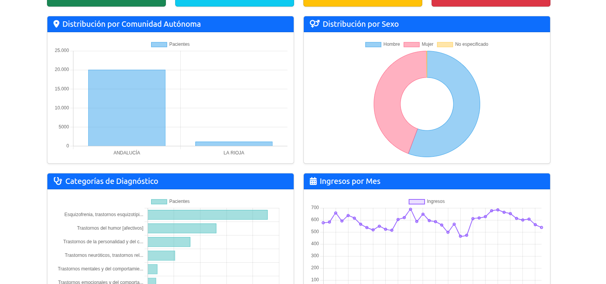

# 🧠 Dashboard de Salud Mental


Dashboard interactivo para análisis y visualización de datos de salud mental en España, desarrollado con Flask y Oracle Autonomous Database.

## 📊 Características

- **Visualización de datos en tiempo real** con gráficos interactivos usando Chart.js
    
- **Filtros avanzados** por comunidad autónoma, sexo, categoría diagnóstica y fechas
    
- **Análisis estadístico** de estancias, costes y admisiones en UCI
    
- **Tabla de datos paginada** con exportación a CSV
    
- **Sistema de autenticación** para acceso seguro
    
- **Diseño responsive** compatible con dispositivos móviles
    
- **Conexión segura** a Oracle Autonomous Database mediante wallet
    

## 🚀 Demo



## 📋 Requisitos Previos

- Python 3.12 o superior
    
- Oracle Autonomous Database (ATP/ADW)
    
- Wallet de Oracle Cloud para conexión segura
    
- pip y virtualenv
    

## 🔧 Instalación

## 1. Clonar el repositorio

```bash
git clone https://github.com/tu-usuario/salud-mental-dashboard.git cd salud-mental-dashboard
```

## 2. Crear y activar entorno virtual

```bash
python -m venv .venv # En Linux/Mac source .venv/bin/activate # En Windows .venv\Scripts\activate
```

## 3. Instalar dependencias

```bash
pip install -r requirements.txt
```

## 4. Configurar variables de entorno

Crea un archivo `.env` en la raíz del proyecto:

```bash
SECRET_KEY=tu-clave-secreta-super-segura 
# Credenciales de login 
LOGIN_USERNAME=admin 
LOGIN_PASSWORD=tu-contraseña-segura 
# Configuración de Oracle Database 
DB_USER=tu-usuario 
DB_PASSWORD=tu-contraseña 
DB_DSN=tcps://tu-host:1522/tu-servicio 
# Wallet de Oracle 
WALLET_LOCATION=/ruta/a/tu/wallet 
WALLET_PASSWORD=tu-password-wallet
```

## 5. Descargar el Wallet de Oracle

1. Accede a tu Oracle Cloud Console
    
2. Ve a tu Autonomous Database
    
3. Descarga el wallet (Database Connection > Download Wallet)
    
4. Descomprime el wallet en una carpeta segura
    
5. Actualiza `WALLET_LOCATION` en el `.env` con la ruta
    

## 🎯 Uso

## Ejecutar la aplicación

```bash
python app.py
```

La aplicación estará disponible en `http://localhost:5000`

## Credenciales de acceso

Usa las credenciales configuradas en tu archivo `.env`:

- **Usuario**: El valor de `LOGIN_USERNAME`
    
- **Contraseña**: El valor de `LOGIN_PASSWORD`
    

## 📁 Estructura del Proyecto

```text
salud-mental-dashboard/
│
├── app.py                      # Aplicación principal Flask
├── config.py                   # Configuración y variables de entorno
├── requirements.txt            # Dependencias del proyecto
├── .env                        # Variables de entorno (no incluir en git)
├── .env.example               # Ejemplo de variables de entorno
├── .gitignore                 # Archivos a ignorar por git
│
├── templates/                  # Plantillas HTML
│   ├── base.html              # Plantilla base
│   ├── login.html             # Página de login
│   ├── index.html             # Dashboard principal
│   └── data_table.html        # Tabla de datos
│
├── static/                     # Archivos estáticos
│   ├── css/
│   │   └── style.css          # Estilos personalizados
│   └── js/
│       └── main.js            # Scripts JavaScript (opcional)
│
└── oracle_wallet/             # Wallet de Oracle (no incluir en git)
    ├── cwallet.sso
    ├── tnsnames.ora
    └── ...
```

## 🗄️ Base de Datos

## Tabla Principal: `ENFERMEDADESMENTALESDIAGNOSTICO`

La aplicación trabaja con datos de salud mental que incluyen:

- **Información demográfica**: Comunidad Autónoma, Sexo, Edad
    
- **Datos clínicos**: Diagnósticos, Categorías, Procedimientos
    
- **Estancias hospitalarias**: Fechas de ingreso, días de estancia
    
- **Información UCI**: Ingresos y días en UCI
    
- **Costes**: Análisis de costes APR
    

## Configuración de la tabla

Si necesitas crear la columna ID como clave primaria:

```sql
ALTER TABLE ENFERMEDADESMENTALESDIAGNOSTICO  ADD (ID NUMBER GENERATED BY DEFAULT ON NULL AS IDENTITY PRIMARY KEY);`
```

## 📊 Funcionalidades

## Dashboard Principal

- **Tarjetas de resumen**: Total de registros, estancia promedio, coste total, ingresos UCI
    
- **Gráfico de comunidades**: Distribución de pacientes por comunidad autónoma
    
- **Gráfico de sexo**: Distribución por género
    
- **Categorías diagnósticas**: Top 7 diagnósticos más frecuentes
    
- **Evolución temporal**: Ingresos por mes con tendencias
    
- **Análisis UCI**: Estadísticas detalladas de ingresos en UCI
    

## Tabla de Datos

- Visualización completa de todos los registros
    
- Paginación para mejor rendimiento
    
- Filtros aplicables en tiempo real
    
- Exportación a CSV de datos filtrados
    

## Filtros Disponibles

- Comunidad Autónoma
    
- Sexo
    
- Categoría Diagnóstica
    
- Rango de fechas (inicio/fin)
    

## 🔐 Seguridad

- **Autenticación** obligatoria para todas las rutas
    
- **Sesiones seguras** con Flask sessions
    
- **Credenciales** almacenadas en variables de entorno
    
- **Conexión encriptada** a Oracle mediante TLS/SSL
    
- **Wallet protegido** con contraseña
    

## 🛠️ Tecnologías Utilizadas

- **Backend**: Flask (Python)
    
- **Base de Datos**: Oracle Autonomous Database
    
- **Driver**: python-oracledb (modo thin)
    
- **Frontend**: Bootstrap 5, Chart.js
    
- **Análisis de Datos**: Pandas, NumPy
    
- **Gestión de Configuración**: python-dotenv
    

## 📦 Dependencias Principales

```text
Flask==3.0.0 oracledb==2.0.0 pandas==2.1.0 numpy==1.24.0 python-dotenv==1.0.0
```

## 🤝 Contribuir

Las contribuciones son bienvenidas. Por favor:

1. Haz fork del proyecto
    
2. Crea una rama para tu feature (`git checkout -b feature/AmazingFeature`)
    
3. Commit tus cambios (`git commit -m 'Add some AmazingFeature'`)
    
4. Push a la rama (`git push origin feature/AmazingFeature`)
    
5. Abre un Pull Request
    

## 📝 Notas de Desarrollo

## Modo Thin vs Thick

La aplicación usa python-oracledb en **modo thin** (sin Oracle Instant Client). Si necesitas modo thick:

1. Descarga Oracle Instant Client
    
2. Descomenta `oracledb.init_oracle_client()` en `app.py`
    
3. Configura la ruta del cliente
    

## Solución de Problemas

**Error de conexión a Oracle:**

- Verifica que el wallet esté en la ubicación correcta
    
- Comprueba las credenciales en el `.env`
    
- Asegúrate de que tu IP está permitida en Oracle Cloud
    

**Error de columnas:**

- Verifica los nombres de columnas en Oracle (case-sensitive)
    
- Usa el script `listar_columnas.py` para verificar
    

**Problemas de autenticación:**

- Verifica que las credenciales en `.env` sean correctas
    
- Comprueba que `SECRET_KEY` esté configurada
    

## 📄 Licencia

Este proyecto está bajo la Licencia MIT. Ver el archivo `LICENSE` para más detalles.

## 👥 Autores

- **Alejandro González** - _Desarrollo web + backend + conexión base de datos oracle_ - [alexgo414](https://github.com/alexgo414)

- **Juan José Marín Pino**
    

## 🙏 Agradecimientos

- Datos proporcionados por el Sistema Nacional de Salud
    
- Malackathon 2025 - Hackathon de la ETSII
    
- Oracle Cloud Infrastructure
    

## 📧 Contacto

Alejandro González - [@alexgo313](https://x.com/alexgo313) - [alejandro.gonvi@gmail.com](mailto:alejandro.gonvi@gmail.com)

Juan José Marín Pino

Link del proyecto: [https://github.com/marpiin/malackathon25](https://github.com/marpiin/malackathon25)

---

⭐️ Si este proyecto te ha sido útil, considera darle una estrella en GitHub